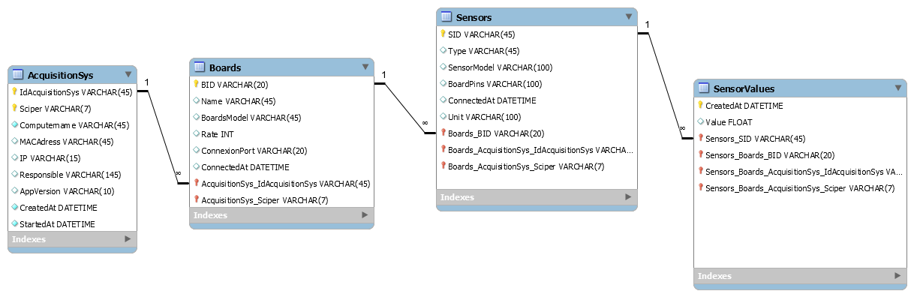

# EPFL-ENAC-GILLIARDDB

## Installation

```bash
$ npm install epfl-enac-gilliarddb
```

## Description

Connexion à la DB pour le projet Gilliard (Service d'acquisition de données Arduino)

## Utilisation

```js
var GilliardDb = require('epfl-enac-gilliarddb')({ hostname: '', }});
```

La variable GilliardDb pourra être utilisée comme un modèle de sequelize à part entière.
Comme par exemple (pour ajouter un systéme d'acquisition) :

```js
GilliardDb.AcquisitionSys
    .findOrCreate(
    {
        where: { $and: [{ IdAcquisitionSys: "1" }, { Sciper: "240312" }] }, defaults: {
            IdAcquisitionSys: "1",
            Sciper: "240312",
            Computername: 'enacitpc30',
            Responsible: "mbonjour <mickael.bonjour@epfl.ch>",
            AppVersion: "0.0.1"
        }
    });
```

## Docs

* [Modèle de la DB en script SQL](./docs/GilliardDbModel.sql)
* [Modèle de la DB en image PNG (à voir ci-dessous aussi)](./docs/GilliardDbModel.png)

## Modèle

[](http://enacit2.epfl.ch/)