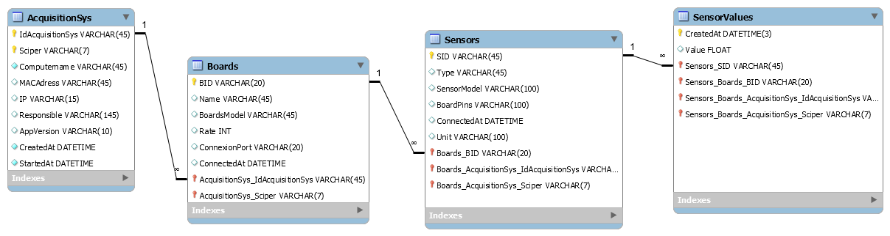

# EPFL-ENAC-GILLIARDDB

## Installation

```bash
$ npm install epfl-enac-gilliarddb
```

## Description

Connexion à la DB pour le projet Gilliard (Service d'acquisition de données Arduino)

## Utilisation

```js
var GilliardDb = require('epfl-enac-gilliarddb')(
    { 
    hostname: '',
    name:'',
    username:'',
    password:''
    }
    );
```

La variable GilliardDb est composée de 2 parties : 
* Elle pourra être utilisée comme un modèle de sequelize à part entière *GilliardDb.models*, ressort un ensemble de modèle sous la forme de la BDD ci-dessous
Comme par exemple (pour ajouter un systéme d'acquisition) :

```js
GilliardDb.models.AcquisitionSys
    .findOrCreate(
    {
        where: { 
            $and: [
                { IdAcquisitionSys: "1" },
                { Sciper: "240312" }
                ]},
            defaults: {
                IdAcquisitionSys: "1",
                Sciper: "240312",
                Computername: 'enacitpc30',
                Responsible: "mbonjour <mickael.bonjour@epfl.ch>",
                AppVersion: "0.0.1"
        }
    });
```

* Ou alors elle peut être utilisée pour des méthodes mise à disposition dans le répertoire repository *GilliardDb.repository*

    * Comme par exemple la méthode insertSensorValue qi insére des valeurs dans la table SensorValue et crée les autres entrées sur toutes les tables pour y arriver si besoin :

```js
GilliardDb.repository.insertSensorValue(
    {
    models:GilliardDb.models,
    configs:configs,    //équivaut au fichier "configs_sample.json" (modifié et renommé en config.json) du projet Gilliard
    acquisitionData:{
           acquisitionSysId:"",
           boardID:"",
           sensorID:"",
           sensorVal:""
      },
       currentBoard:{/*un objet de "boards" correspondant aux configs*/} 
    })
```

## Docs

* [Modèle de la DB en script SQL](./docs/GilliardDbModels.sql)
* [Modèle de la DB en image PNG (à voir ci-dessous aussi)](./docs/GilliardDbModels.png)
* [Lien sur la documentation Sequelize](http://docs.sequelizejs.com/en/latest/)

## Modèle de la DB

[]